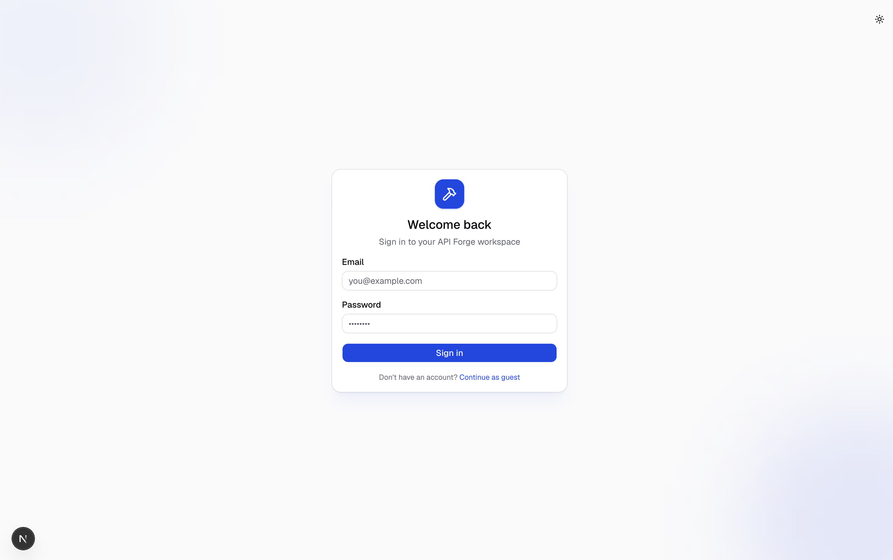
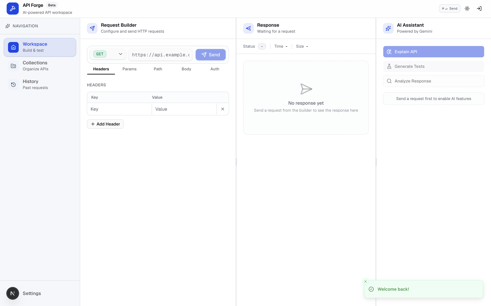
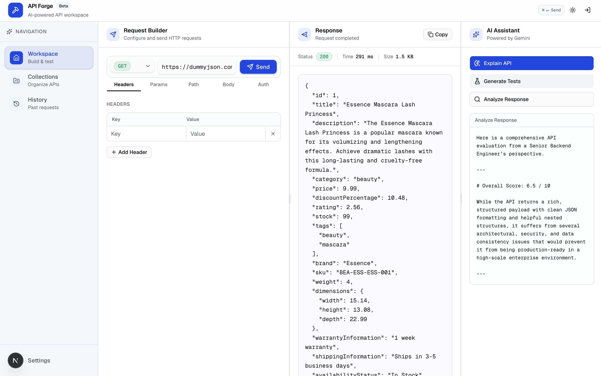
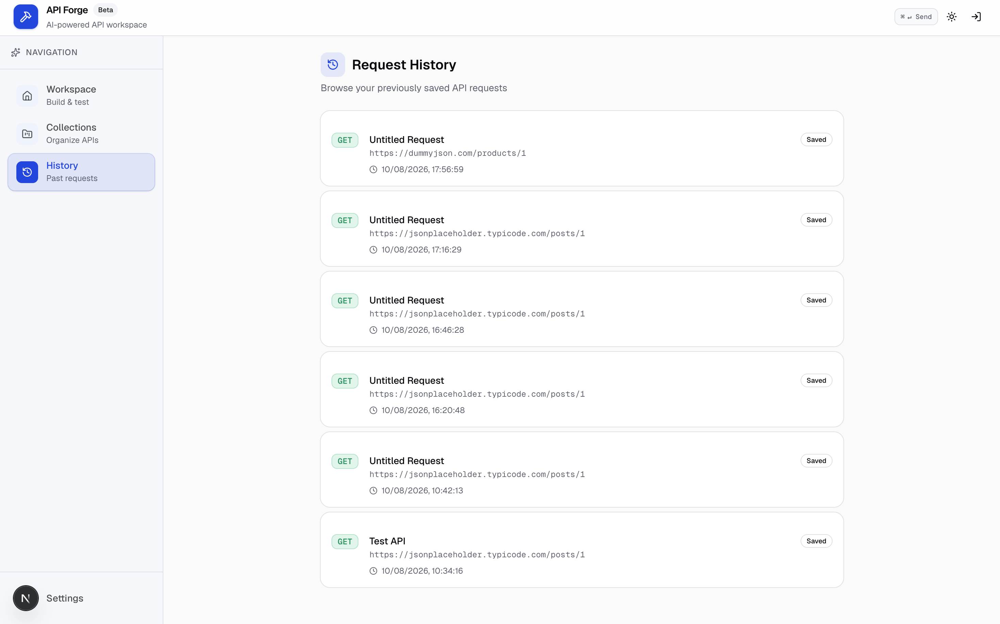

<div align="center">

# 🚀 API Forge

### AI-Powered API Testing Workspace

A modern Postman-inspired API client built using **Next.js**, **Node.js**, **Express**, **MongoDB**, and **Google Gemini AI**.

Test APIs, inspect responses, manage authentication, and leverage AI to explain endpoints, generate test cases, and analyze API responses—all from a clean and intuitive interface.


</div>

---

# 📸 Screenshots

## Login



---

## Dashboard

The main workspace includes the request builder, response viewer, collections, history panel, and AI assistant.



---

## Response Viewer

Inspect HTTP status codes, response time, response size, and formatted JSON responses.



---

## Request History

Quickly access previously executed API requests.



---

# ✨ Features

### 🔐 Authentication

- JWT Authentication
- User Registration & Login
- Protected API Routes

### 🌐 API Testing

- GET
- POST
- PUT
- PATCH
- DELETE

### 🛠 Request Builder

- Custom Headers
- Query Parameters
- JSON Request Body
- Authorization Support

### 📊 Response Viewer

- Pretty JSON Formatting
- HTTP Status Code
- Response Time
- Response Size

### 🤖 AI Assistant (Gemini)

- Explain API
- Generate Test Cases
- Analyze API Responses

### 🎨 Modern UI

- Clean Interface
- Responsive Design
- Dark Theme
- Developer Friendly Experience

---

# 🛠 Tech Stack

## Frontend

- Next.js 16
- React
- TypeScript
- Tailwind CSS
- shadcn/ui
- Lucide React
- React Markdown

## Backend

- Node.js
- Express.js
- MongoDB
- Mongoose
- JWT Authentication
- Google Gemini API

## Tools

- Axios
- REST APIs
- Git
- GitHub

---

# 📂 Project Structure

```text
API-Forge
│
├── app
├── components
│   ├── ai
│   ├── request-builder
│   ├── response
│   ├── history
│   └── layout
│
├── forge-server
│   ├── controllers
│   ├── middleware
│   ├── models
│   ├── routes
│   ├── services
│   └── validators
│
├── screenshots
│
└── README.md
```

---

# 🚀 Installation

Clone the repository

```bash
git clone https://github.com/Yugg09/API-Forge.git
```

Move into the project

```bash
cd API-Forge
```

Install frontend dependencies

```bash
npm install
```

Install backend dependencies

```bash
cd forge-server
npm install
```

Run the backend

```bash
npm run dev
```

Run the frontend

```bash
cd ..
npm run dev
```

---

# 🔑 Environment Variables

Create a `.env` file inside the **forge-server** directory.

```env
PORT=8000

MONGO_URI=your_mongodb_connection_string

JWT_SECRET=your_secret_key

GEMINI_API_KEY=your_gemini_api_key
```

---

# 🤖 AI Capabilities

### 🧠 Explain API

Understand what an endpoint does in simple language.

### 🧪 Generate Tests

Automatically generate meaningful test cases for an endpoint.

### 🔍 Analyze Response

Receive AI-powered insights, summaries, and suggestions based on API responses.

---

# 🚀 Future Improvements

- API Collections
- Environment Variables
- Import Postman Collections
- Export Requests
- GraphQL Support
- WebSocket Testing
- Request Sharing
- Team Collaboration

---

# 🤝 Contributing

Contributions are welcome.

1. Fork the repository

2. Create your feature branch

```bash
git checkout -b feature/new-feature
```

3. Commit your changes

```bash
git commit -m "Add new feature"
```

4. Push your branch

```bash
git push origin feature/new-feature
```

5. Open a Pull Request

---

# 📄 License

This project is licensed under the MIT License.

---

# 👨‍💻 Author

**Yug Chaudhary**

GitHub: https://github.com/Yugg09

---

<div align="center">

⭐ If you like this project, consider giving it a star!

</div>
